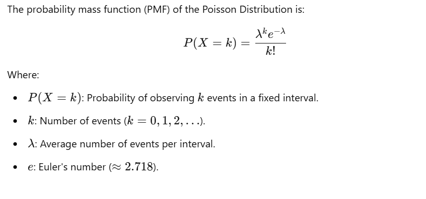

In statistics, **distribution** refers to the way data values are spread out or distributed across a range. It provides a framework for understanding the overall structure of the data, including patterns, variability, and central tendencies. Different types of distributions affect how data is analyzed, interpreted, and modeled.

---

### **Key Concepts of Distribution**

1. **Definition**:

   - A statistical distribution is a representation, either in a table, graph, or mathematical equation, that shows all possible values or intervals of data and how frequently they occur.

2. **Types of Distributions**:

   - **Discrete Distributions**: Values are countable, e.g., the number of customers in a store (e.g., Poisson, Binomial).
   - **Continuous Distributions**: Values fall within a range and can take any value, e.g., height, weight (e.g., Normal, Uniform, Exponential).

3. **Descriptive Characteristics**:
   - **Mean**: Average value of the data.
   - **Median**: Middle value when data is sorted.
   - **Mode**: Most frequently occurring value.
   - **Variance and Standard Deviation**: Measures of data spread or variability.
   - **Skewness**: Asymmetry in the data distribution.
   - **Kurtosis**: The sharpness or flatness of the peak.

---

### **How Distribution Affects Data Analysis**

1. **Choosing the Right Statistical Test**:

   - Many tests (e.g., t-test, ANOVA) assume normality. Skewed or non-normal data may require transformations or non-parametric tests.

2. **Predictive Modeling**:

   - Algorithms like linear regression perform better when residuals are normally distributed.
   - Non-normal distributions may require specialized models (e.g., logistic regression for binary outcomes).

3. **Estimation and Confidence Intervals**:

   - The type of distribution influences the calculation of confidence intervals and standard errors.

4. **Detecting Outliers**:

   - Distributions help identify outliers by analyzing tails.

5. **Interpreting Variability**:

   - Spread (variance/standard deviation) affects predictions, quality control, and decision-making.

6. **Hypothesis Testing**:
   - Knowing the underlying distribution ensures proper interpretation of p-values and test results.

---

### **Real-World Applications**

- **Healthcare**: Normal distribution helps analyze patient data like blood pressure or cholesterol levels.
- **Finance**: Log-normal distributions are often used for stock prices.
- **Manufacturing**: Quality control relies on the distribution of product measurements.
- **Environmental Science**: Distributions model phenomena like rainfall or pollutant levels.

Understanding distribution allows statisticians to tailor their analysis techniques, make accurate inferences, and derive meaningful conclusions from data.

### **Common Types of Distributions in Statistics**

#### **1. Discrete Distributions**

Discrete distributions describe data that can only take specific, countable values (e.g., integers). Examples include outcomes from rolling a die, coin tosses, or counts of events.

1. **Binomial Distribution**

   - **Use**: Models the number of successes in \( n \) independent trials with a fixed probability \( p \) of success.
   - **Example**: Tossing a coin \( n = 10 \) times and counting heads.
   - **Key Parameters**: \( n \) (number of trials), \( p \) (probability of success).

2. **Poisson Distribution**

   - **Use**: Models the number of events occurring in a fixed interval of time or space when events occur independently and at a constant rate.
   - **Example**: Number of customer arrivals at a store per hour.
   - **Key Parameter**: \( \lambda \) (average rate of occurrence).

3. **Geometric Distribution**

   - **Use**: Models the number of trials required for the first success in a sequence of Bernoulli trials.
   - **Example**: Tossing a coin until the first head appears.
   - **Key Parameter**: \( p \) (probability of success).

4. **Hypergeometric Distribution**

   - **Use**: Models successes in a sample drawn without replacement from a finite population.
   - **Example**: Drawing red balls from an urn containing both red and white balls.
   - **Key Parameters**: \( N \) (population size), \( K \) (number of successes in the population), \( n \) (sample size).

5. **Negative Binomial Distribution**
   - **Use**: Models the number of failures before achieving a specified number of successes.
   - **Example**: Number of failed attempts before hitting a target.
   - **Key Parameters**: \( r \) (number of successes), \( p \) (probability of success).

---

#### **2. Continuous Distributions**

Continuous distributions describe data that can take any value within a range, often associated with measurements.

1. **Normal Distribution**

   - **Use**: Models symmetrical data where most values cluster around the mean.
   - **Example**: Heights of people, test scores.
   - **Key Parameters**: \( \mu \) (mean), \( \sigma \) (standard deviation).

2. **Uniform Distribution**

   - **Use**: Models data where all outcomes in a range are equally likely.
   - **Example**: Rolling a perfectly balanced die.
   - **Key Parameters**: \( a \) (minimum value), \( b \) (maximum value).

3. **Exponential Distribution**

   - **Use**: Models the time between events in a Poisson process.
   - **Example**: Time until the next customer arrives.
   - **Key Parameter**: \( \lambda \) (rate parameter).

4. **Log-Normal Distribution**

   - **Use**: Models data that is positively skewed, often representing multiplicative processes.
   - **Example**: Stock prices or income distributions.
   - **Key Parameters**: \( \mu \) (mean of the log), \( \sigma \) (standard deviation of the log).

5. **Chi-Square Distribution**

   - **Use**: Often used in hypothesis testing, particularly for variance and categorical data tests.
   - **Example**: Testing independence in a contingency table.
   - **Key Parameter**: \( k \) (degrees of freedom).

6. **Beta Distribution**

   - **Use**: Models probabilities or proportions constrained between 0 and 1.
   - **Example**: Proportion of defective items in production.
   - **Key Parameters**: \( \alpha \), \( \beta \) (shape parameters).

7. **Gamma Distribution**
   - **Use**: Generalization of the exponential distribution, often modeling waiting times.
   - **Example**: Time to complete multiple tasks.
   - **Key Parameters**: \( \alpha \) (shape), \( \beta \) (rate).

---

### **Comparison of Discrete and Continuous Distributions**

| **Aspect**               | **Discrete**                    | **Continuous**                     |
| ------------------------ | ------------------------------- | ---------------------------------- |
| **Possible Values**      | Countable (e.g., integers)      | Infinite (e.g., real numbers)      |
| **Examples**             | Binomial, Poisson, Geometric    | Normal, Uniform, Exponential       |
| **Graph Representation** | Probability Mass Function (PMF) | Probability Density Function (PDF) |

Understanding the type of distribution (discrete or continuous) helps guide statistical analysis, model selection, and decision-making.

## **Binomial Distribution**

---

#### **1. What is the Binomial Distribution?**

The **Binomial Distribution** models the number of successes in a fixed number of independent trials, where each trial has only two possible outcomes: **success** or **failure**. The probability of success remains constant across all trials.

- **Examples**: Tossing a coin (heads/tails), rolling a die to check for a specific number, quality control (defective/non-defective items).

---

#### **2. Mathematical Formula and Components**

The probability mass function (PMF) of the Binomial Distribution is:


---

#### **3. Sample Data to Illustrate Application**


---

#### **4. Step-by-Step Derivation and Visualization**


#### **5. Pros, Cons, and Key Properties**


#### **6. Applications and Real-World Examples**

**Applications:**

- Quality Control: Probability of defective items in a batch.
- Marketing: Likelihood of customers responding to a campaign.
- Medicine: Success rates of treatments in clinical trials.

**Real-World Examples:**

- Rolling a die to check for sixes (\( p = \frac{1}{6} \)).
- Testing a batch of bulbs to determine defective rates (\( p = 0.1 \), \( n = 20 \)).

---

#### **7. Importance in Statistics and Machine Learning**

**Statistics:**

- Helps model binary outcomes in hypothesis testing.
- Forms the basis for many inferential methods.

**Machine Learning:**

- Used in **logistic regression**, which models binary classification problems.
- Binary outcomes often serve as labels for supervised learning tasks.

Understanding the Binomial Distribution is critical because it bridges theoretical statistics and practical machine learning applications, offering insights into probabilistic modeling and decision-making under uncertainty.

---

#### **8. Python Implementation**

Here’s how you can compute and visualize the Binomial Distribution in Python:

```python
import numpy as np
import matplotlib.pyplot as plt
from scipy.stats import binom

# Parameters
n = 5  # Number of trials
p = 0.6  # Probability of success

# Possible outcomes (0 to n successes)
x = np.arange(0, n+1)

# Calculate probabilities
probabilities = binom.pmf(x, n, p)

# Display probabilities
print("Probabilities for each outcome:", probabilities)

# Visualization
plt.bar(x, probabilities, color='skyblue', alpha=0.7, edgecolor='black')
plt.title("Binomial Distribution (n=5, p=0.6)")
plt.xlabel("Number of successes (k)")
plt.ylabel("Probability")
plt.xticks(x)
plt.grid(axis='y', linestyle='--', alpha=0.7)
plt.show()
```

This will output the probabilities for each outcome and display a bar chart of the distribution.

---

By understanding and applying the Binomial Distribution, you can analyze and interpret binary-outcome data effectively, making it a crucial tool in both statistics and machine learning.

---

## **Poisson Distribution**

#### **1. What is the Poisson Distribution?**

The **Poisson Distribution** models the probability of a given number of events occurring in a fixed interval of time or space, provided these events happen:

1. Independently of each other.
2. At a constant average rate λ.
3. Without any two events happening simultaneously.

It is often used to model rare events, such as the number of earthquakes in a region or the number of customers arriving at a store in a given hour.

---

#### **2. Mathematical Formula**



#### **3. Sample Data**

Suppose a call center receives an average of λ = 3 calls per hour. We want to calculate the probability of receiving exactly 4 calls in an hour ( k = 4 ).

---

#### **4. Step-by-Step Derivation and Visualization**


#### **5. Pros, Cons, and Key Properties**

**Pros:**

- Suitable for modeling rare events.
- Simple to compute and interpret.
- Only one parameter λ is needed.

**Cons:**

- Assumes events occur independently and at a constant rate.
- Not suitable for over-dispersed or under-dispersed data.

**Key Properties:**

- **Mean**: μ=λ
- **Variance**: σ^2 = λ
- **Skewness**: 1/(sqrt{λ} )
- **Kurtosis**: 1/(λ)

---

#### **6. Applications and Real-World Examples**

**When to Use:**

- Events are discrete and occur independently.
- The average event rate is known and constant over time or space.

**Real-World Examples:**

- Number of customer arrivals at a store per hour.
- Number of typing errors per page in a document.
- Number of accidents at a traffic intersection in a day.

---

#### **7. Importance in Statistics and Machine Learning**

1. **In Statistics**:

   - Helps model count data.
   - Integral to hypothesis testing for rare events (e.g., testing if an event rate differs from historical data).

2. **In Machine Learning**:
   - Forms the basis for Poisson regression, used for modeling count-based response variables.
   - Useful in Natural Language Processing for modeling word frequencies.

---

#### **8. Python Implementation**

Here’s how to compute and visualize the Poisson Distribution in Python:

```python
import numpy as np
import matplotlib.pyplot as plt
from scipy.stats import poisson

# Parameter
lam = 3  # Average rate of events (lambda)

# Possible outcomes (number of events)
k = np.arange(0, 11)  # Range of event counts (0 to 10)

# Calculate probabilities
probabilities = poisson.pmf(k, lam)

# Display probabilities
print("Probabilities for each outcome:", probabilities)

# Visualization
plt.bar(k, probabilities, color='skyblue', alpha=0.7, edgecolor='black')
plt.title("Poisson Distribution (λ = 3)")
plt.xlabel("Number of events (k)")
plt.ylabel("Probability")
plt.xticks(k)
plt.grid(axis='y', linestyle='--', alpha=0.7)
plt.show()
```

**Output**: The probabilities for \( k = 0, 1, 2, \dots, 10 \), and a bar chart showing the distribution.

---

By understanding and applying the Poisson Distribution, you can effectively model and analyze count-based data, making it a critical tool in both statistical and machine learning contexts.
