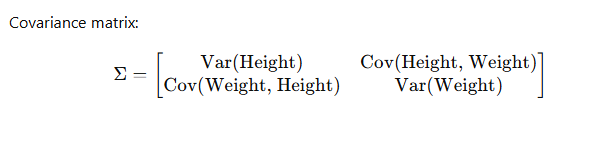

## **Principal Component Analysis (PCA) – Explained Simply**

### **1. What is PCA?**

Principal Component Analysis (PCA) is a **dimensionality reduction** technique used to simplify complex datasets **while preserving the most important patterns**.

**Think of PCA like this:**  
Imagine you have a high-resolution **photo (large data)**, but you need to **compress** it without losing much detail. PCA finds the **essential features** and removes redundant ones.

---

### **2. Why Do We Need PCA?**

✅ **Removes redundancy** in data (like removing similar columns in a dataset).  
✅ **Reduces computational cost** by making datasets smaller.  
✅ **Helps in visualization** of high-dimensional data (e.g., reducing 100D data to 2D for plotting).  
✅ **Improves model performance** by reducing overfitting in machine learning.

---

### **3. PCA Intuition with an Example**

Imagine you have a dataset of **students' height and weight**:  
| Student | Height (cm) | Weight (kg) |  
|---------|------------|------------|  
| A | 170 | 65 |  
| B | 160 | 55 |  
| C | 180 | 75 |  
| D | 165 | 60 |

Here, **height and weight are related**—taller people tend to weigh more. Instead of treating these as two separate features, PCA finds a **new axis** that best represents both.

📌 **PCA’s Goal**: Find a new direction (principal component) that best represents the data **with minimal information loss**.

---

### **4. How PCA Works (Step-by-Step with Math)**

#### **Step 1: Standardize the Data**

Since features have different scales (e.g., cm vs. kg), we standardize them:

\[
Z = \frac{X - \text{mean}(X)}{\text{std}(X)}
\]

Now, the dataset has **zero mean** and **unit variance**.

---

#### **Step 2: Compute the Covariance Matrix**

PCA analyzes how features **vary together**. Covariance tells us:

- **High covariance** → Two features are strongly related.
- **Low covariance** → Features are independent.

Covariance matrix:

---

#### **Step 3: Compute Eigenvalues and Eigenvectors**

- **Eigenvectors** → New axes (principal components).
- **Eigenvalues** → How much variance each axis captures.

**Example Interpretation:**  
If PCA gives two eigenvalues **(80%, 20%)**, it means:

- **1st component captures 80% of the information**.
- **2nd component captures only 20%** (can be ignored!).

---

#### **Step 4: Select Principal Components**

We pick **top-K components** that capture the most variance.  
For example, if the first component captures **90%+ variance**, we can **reduce** the dataset from 2D (Height, Weight) to 1D.

---

#### **Step 5: Transform Data to New Dimensions**

Finally, we **project data onto the new axis** (new feature space).

\[
Z' = X \*s W
\]

where **W** is the matrix of top eigenvectors.

---

### **5. Real-World Example of PCA**

📌 **Face Recognition** → PCA reduces thousands of pixel features to **a few principal components**, making recognition faster.  
📌 **Stock Market Data** → Instead of tracking 500 stocks, PCA finds a few major trends.  
📌 **NLP (Topic Modeling)** → PCA reduces **word vector dimensions** to improve processing.

---

### **6. PCA Limitations**

❌ **Loses interpretability** → New axes don’t have direct meanings.  
❌ **Assumes linear relationships** between features.  
❌ **Sensitive to scaling** → Data **must be standardized** first.

## **When to Apply PCA (Best Cases) and When to Avoid It (Worst Cases & Limitations)**

### **✅ Best Cases for Applying PCA**

1️⃣ **Dimensionality Reduction** (When Too Many Features)

- Example: A dataset with **1000 features** (genes in biology, pixels in images). PCA reduces it to **10–50 features** while keeping most information.
- **Why?** Fewer features → Faster computation & avoids overfitting in ML models.

2️⃣ **Visualization of High-Dimensional Data**

- Example: A dataset with **100D** (e.g., text embeddings, stock prices).
- **Why?** PCA reduces it to **2D or 3D**, making it possible to visualize clusters.

3️⃣ **Noise Reduction / Data Compression**

- Example: **Image compression** (reducing pixels while maintaining quality).
- **Why?** PCA removes unimportant features (noise) and retains dominant patterns.

4️⃣ **Feature Extraction (When Features are Correlated)**

- Example: **Height and weight are correlated** → PCA creates a new **single feature** (body size).
- **Why?** It removes redundancy and simplifies models.

5️⃣ **Speeding Up Machine Learning Models**

- Example: **Deep learning models on high-dimensional datasets (e.g., medical images, NLP).**
- **Why?** Reduces training time by lowering the number of input features.

---

### **❌ Worst Cases to Apply PCA (When to Avoid It)**

1️⃣ **When Data is NOT Linearly Related**

- Example: PCA won’t work well for datasets with **complex, nonlinear relationships** (e.g., text sequences, non-Euclidean data).
- **Alternative:** Use **t-SNE or UMAP** for better non-linear dimensionality reduction.

2️⃣ **When Features Have Different Meanings (Interpretability Loss)**

- Example: If PCA is applied to customer data (e.g., **Age, Salary, Purchase Frequency**), the new principal components **don’t have direct business meaning**.
- **Alternative:** Feature engineering instead of PCA.

3️⃣ **When Features Have Different Scales but Are NOT Standardized**

- Example: PCA doesn’t work well if one feature (e.g., **Salary in $100K range**) is much larger than another (e.g., **Age in 20-60 range**).
- **Fix:** Always **standardize** data before using PCA (**zero mean, unit variance**).

4️⃣ **When You Need Interpretability of Features**

- Example: If you need to explain which features influence a prediction (e.g., in finance, healthcare).
- **Why?** PCA converts features into **abstract principal components**, making them hard to interpret.

5️⃣ **When You Need to Retain Small Variations in Data**

- Example: PCA might remove **small but meaningful differences** in medical or genetic data.
- **Fix:** Carefully choose the number of principal components (don’t over-compress).

---

### **🔴 Limitations of PCA**

🚫 **Assumes Linear Relationships** → Doesn’t capture complex relationships between variables.  
🚫 **Sensitive to Outliers** → A single large outlier can distort PCA results.  
🚫 **Loses Some Information** → PCA approximates the original dataset, so **some variance is lost**.  
🚫 **Can Be Computationally Expensive** → For very large datasets, PCA can be slow.  
🚫 **Hard to Interpret Components** → The transformed features (PC1, PC2, etc.) don’t always have real-world meanings.

---

### **🔥 Summary: When to Use & Avoid PCA**

| Scenario                                                   | Use PCA? | Alternative        |
| ---------------------------------------------------------- | -------- | ------------------ |
| Too many features (dimensionality reduction)               | ✅ Yes   | -                  |
| Visualizing high-dimensional data                          | ✅ Yes   | t-SNE, UMAP        |
| Features are highly correlated                             | ✅ Yes   | Feature selection  |
| Data is non-linear                                         | ❌ No    | t-SNE, UMAP        |
| Features have different meanings (interpretability needed) | ❌ No    | Feature selection  |
| Raw data contains important small variations               | ❌ No    | Keep original data |

## **t-SNE (t-Distributed Stochastic Neighbor Embedding) – Explained Simply**

### **1. What is t-SNE?**

**t-SNE** is a **non-linear dimensionality reduction** technique used for **visualizing high-dimensional data** in **2D or 3D**. Unlike PCA, which focuses on **variance**, t-SNE preserves the **local structure** of data, meaning similar points stay close together.

---

### **2. Why Use t-SNE?**

✅ **Great for visualizing clusters** in high-dimensional data (e.g., word embeddings, image features, genetic data).  
✅ **Preserves local relationships** → Similar points in high dimensions remain close in lower dimensions.  
✅ **Better than PCA for complex datasets** (since PCA is linear, while t-SNE captures non-linear relationships).

**Example:**  
Suppose you have **handwritten digit images (MNIST dataset)** (each image is **784D**, i.e., 28×28 pixels).

- **PCA reduces it to 2D, but might mix different digits together**.
- **t-SNE maps similar-looking digits closer while keeping different digits apart**.

---

### **4. When to Use t-SNE?**

✅ **Visualizing high-dimensional data (word embeddings, images, genomics, etc.)**  
✅ **Clustering tasks (understanding natural groupings in data)**  
✅ **Reducing noise while preserving meaningful relationships**

---

### **5. Limitations of t-SNE**

❌ **Only for visualization** → Can’t be used as a general-purpose dimensionality reduction like PCA.  
❌ **Computationally expensive** → Slower than PCA for large datasets.  
❌ **Non-deterministic (Results change each run)** → Needs proper tuning (perplexity, learning rate).  
❌ **Bad for preserving global structure** → Focuses only on local relationships.

---
